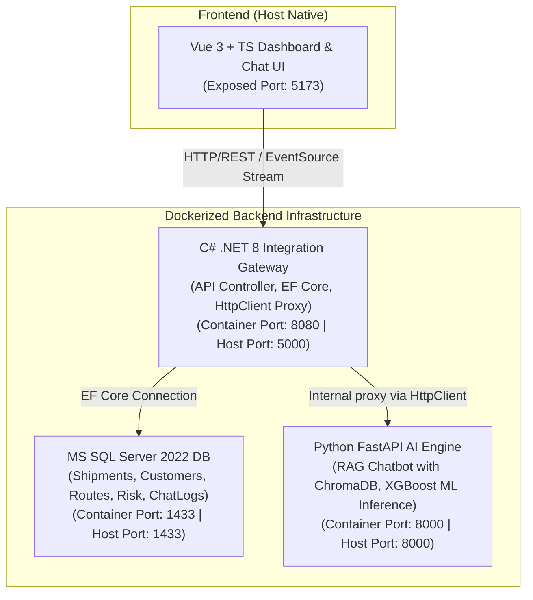

# 🚀 SmartLogix – AI-powered Logistics Operations Hub

SmartLogix is an enterprise-grade logistics orchestration platform designed to streamline supply chain tasks. It combines a robust **C# .NET 8 Web API Integration Gateway**, a **Python FastAPI AI/ML Engine** (handling RAG search and classical Machine Learning risk predictions), a **MS SQL Server 2022** relational database, and an interactive **Vue 3 + TypeScript Frontend** dashboard.

---

## 🏗️ System Architecture

The following diagram illustrates the decoupled, microservices-inspired architecture:



### Decoupling Rationale

- **Vue 3 + TypeScript (Native):** Runs directly on the host machine to leverage lightning-fast Hot Module Replacement (HMR) and instantaneous feedback loops during frontend design.
- **C# .NET 8 Web API (Docker):** Represents a typical enterprise ERP core environment. Handles strict business contracts, secure user management (JWT), transactional operations, and forwards AI-specific requests down to Python.
- **Python FastAPI Service (Docker):** Focused exclusively on compute-heavy AI/ML operations (vector searches, prompt building, LLM streaming, Classical ML regression/classification), exposing endpoints through a simple, high-performance REST API.
- **MS SQL Server 2022 (Docker):** Central database with all primary operational, prediction, and interaction log tables.

---

## 📋 Infrastructure Ports Mapping

| Service               | Container Port | Host Port | Internal Docker Network Name |
| :-------------------- | :------------- | :-------- | :--------------------------- |
| **MS SQL Server**     | `1433`         | `1433`    | `db-mssql`                   |
| **.NET 8 Web API**    | `8080`         | `5000`    | `backend-net`                |
| **FastAPI AI Engine** | `8000`         | `8000`    | `ai-engine-python`           |
| **Vue 3 Web Client**  | _N/A (Host)_   | `5173`    | _N/A (Access via localhost)_ |

---

## 🚀 Getting Started

### Prerequisites

- [Docker](https://docs.docker.com/get-docker/)
- [Docker Compose Plugin](https://docs.docker.com/compose/install/)
- [Node.js (v18+)](https://nodejs.org/) & [NPM](https://www.npmjs.com/) _(for the future Frontend module)_

### 1. Launch Backend Infrastructure (Docker Compose)

In the root directory, simply run one command to build and launch the MS SQL DB, C# Web API, and Python FastAPI server:

```bash
docker compose up --build -d
```

#### Monitoring Startup & Databases

You can view active application logs to watch EF Core automatically build the database schema and insert logistics seed data:

```bash
docker compose logs -f
```

### 2. Verify Services are Running

Once containers are launched and healthy, check their availability:

```

### 2. Verify Services are Running

Once containers are launched and healthy, check their availability:

- **.NET 8 Gateway Swagger UI:** [http://localhost:5000/swagger/index.html](http://localhost:5000/swagger/index.html)
- **.NET Customers API Endpoint:** `curl http://localhost:5000/api/customers`
- **.NET Shipments API Endpoint:** `curl http://localhost:5000/api/shipments`
- **Python FastAPI Health Check:** `curl http://localhost:8000/`
```
