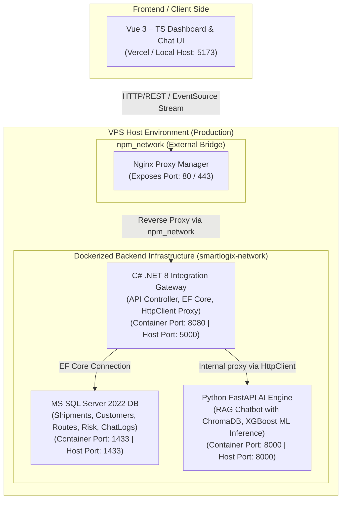

# SmartLogix — AI-powered Logistics Operations Hub

SmartLogix is an enterprise-grade logistics orchestration platform designed to streamline supply chain tasks. It combines a robust **C# .NET 8 Web API Integration Gateway**, a **Python FastAPI AI/ML Engine** (handling RAG search and classical Machine Learning risk predictions), a **MS SQL Server 2022** relational database, and an interactive **Vue 3 + TypeScript Frontend** dashboard.

---

## 🏗️ System Architecture



### Decoupling Rationale

- **Vue 3 + TypeScript (Native):** Runs directly on the host machine to leverage lightning-fast Hot Module Replacement (HMR) and instantaneous feedback loops during frontend design.
- **C# .NET 8 Web API (Docker):** Represents a typical enterprise ERP core environment. Handles strict business contracts, secure user management (JWT), transactional operations, and forwards AI-specific requests down to Python.
- **Python FastAPI Service (Docker):** Focused exclusively on compute-heavy AI/ML operations (vector searches, prompt building, LLM streaming, Classical ML regression/classification), exposing endpoints through a simple, high-performance REST API.
- **MS SQL Server 2022 (Docker):** Central database with all primary operational, prediction, and interaction log tables.

### 🌐 Production Request Flow (VPS)

When deployed on a production VPS behind Nginx Proxy Manager (NPM):

1. **Client (Vue 3)**: Sends standard HTTP REST or EventSource SSE (Server-Sent Events) streaming requests to the server IP or domain (listening on NPM ports `80` or `443`).
2. **Nginx Proxy Manager**: Captures the request and reverse-proxies it to the C# backend (`http://backend-net:8080`) over the shared external `npm_network` docker network.
   * *SSE Optimization*: Nginx buffering and caching are bypassed for standard API routes to allow instantaneous, real-time AI token delivery.
3. **C# .NET 8 Gateway (`backend-net`)**: Enforces JWT authentication.
   * For relational DB operations (CRUD), it communicates directly with MS SQL (`db-mssql:1433`) within the private `smartlogix-network`.
   * For ML and RAG operations, it proxies requests internally using its configured `HttpClient` (targeting `http://ai-engine-python:8000`).
4. **Python FastAPI Engine (`ai-engine-python`)**: Computes delay risk using XGBoost, or triggers a ChromaDB vector RAG search, returning real-time stream tokens (`text/event-stream`) that flow straight back to the client browser.

---

## 📋 Infrastructure Ports Mapping

| Service               | Container Port | Host Port | Docker Network | Description |
| :-------------------- | :------------- | :-------- | :------------- | :---------- |
| **MS SQL Server**     | `1433`         | `1433`    | `smartlogix-network` | Private DB storage |
| **.NET 8 Web API**    | `8080`         | `5000`    | `smartlogix-network`, `npm_network` | Public-facing integration gateway |
| **FastAPI AI Engine** | `8000`         | `8000`    | `smartlogix-network` | Private ML inference and RAG search |
| **Vue 3 Web Client**  | _N/A (Host)_   | `5173`    | _N/A (Access via localhost)_ | Dashboard & interactive chat client |

---

## 🚀 Getting Started

### Prerequisites

- [Docker](https://docs.docker.com/get-docker/)
- [Docker Compose Plugin](https://docs.docker.com/compose/install/)
- [Node.js (v18+)](https://nodejs.org/) & [pnpm](https://pnpm.io/installation) _(for frontend)_

### 1. Launch Backend Infrastructure (Docker Compose)

In the root directory, simply run one command to build and launch the MS SQL DB, C# Web API, and Python FastAPI server:

```bash
docker compose up --build -d
```

#### Monitoring Startup & Databases

You can view active application logs to watch EF Core automatically build the database schema and insert logistics seed data:

```bash
docker compose logs -f
```

### 2. Verify Services are Running

Once containers are launched and healthy, check their availability:

- **.NET 8 Gateway Swagger UI:** [http://localhost:5000/swagger/index.html](http://localhost:5000/swagger/index.html)
- **.NET Customers API Endpoint:** `curl http://localhost:5000/api/customers`
- **.NET Shipments API Endpoint:** `curl http://localhost:5000/api/shipments`
- **Python FastAPI Health Check:** `curl http://localhost:8000/`

### 3. Launch Frontend (Native Host)

```bash
cd frontend-vue
pnpm install --frozen-lockfile
pnpm run dev
```

Access the frontend at [http://localhost:5173](http://localhost:5173).

---

## 🌐 Deployment

### Frontend (Vercel)

The Vue 3 frontend is configured for deployment on [Vercel](https://vercel.com).

```bash
cd frontend-vue
vercel deploy --prod
```

Or connect your GitHub repository to Vercel for automatic deployments on every push to `main`.

**Environment Variables for Vercel:**
```
VITE_API_NET=https://api.smartlogix.example.com
VITE_WS_URL=wss://api.smartlogix.example.com/ws
```

### Backend (Azure App Service / Railway / Render)

The .NET 8 Web API can be deployed to:

- **Azure App Service** — Use the `Dockerfile` at `backend-net/` for containerized deployment
- **Railway** — Connect your GitHub repo and set environment variables
- **Render** — Use the provided `Dockerfile`

**Required Environment Variables:**
```
ConnectionStrings__DefaultConnection=Server=your-azure-sql-server.database.windows.net;Database=SmartLogixDB;User Id=your-user;Password=your-password;Encrypt=True;
ASPNETCORE_ENVIRONMENT=Production
```

### AI Engine (Railway / Render / Hugging Face Spaces)

The Python FastAPI AI Engine can be deployed to:

- **Railway** — Containerized deployment using the provided `Dockerfile`
- **Render** — Use the `Dockerfile` at `ai-engine-python/`
- **Hugging Face Spaces** — Requires adapting to Spaces' format

**Required Environment Variables:**
```
OPENAI_API_KEY=sk-...
ANTHROPIC_API_KEY=sk-ant-...
GOOGLE_API_KEY=...
CORS_ALLOWED_ORIGINS=https://your-frontend.vercel.app
```

### Database (Azure SQL / Supabase / Neon)

For production, replace the local Docker MS SQL Server with a managed cloud database:

- **Azure SQL Database** — Recommended for enterprise grade
- **Supabase Postgres** — Open source alternative
- **Neon Postgres** — Serverless Postgres

Update the `ConnectionStrings__DefaultConnection` in your backend deployment accordingly.

---

## 🔧 Environment Variables

Copy `.env.example` to `.env` and fill in your values before running locally.

| Variable | Description | Example |
|----------|-------------|---------|
| `MSSQL_SA_PASSWORD` | SQL Server SA password | `SmartLogix@SecurePassword2026` |
| `MSSQL_DB` | Database name | `SmartLogixDB` |
| `OPENAI_API_KEY` | OpenAI API key for LLM | `sk-...` |
| `ANTHROPIC_API_KEY` | Anthropic API key for Claude | `sk-ant-...` |
| `GOOGLE_API_KEY` | Google Gemini API key | `AIza...` |
| `CORS_ALLOWED_ORIGINS` | Allowed CORS origins | `http://localhost:5173,https://your-frontend.vercel.app` |
| `ASPNETCORE_ENVIRONMENT` | .NET environment | `Development` or `Production` |

---

## 🧪 CI/CD

This project uses GitHub Actions for continuous integration across all three services:

- **Frontend CI** — Runs on push/PR to `frontend-vue/` — lints, type-checks, and builds
- **Backend .NET CI** — Runs on push/PR to `backend-net/` — restores, builds, and packages
- **AI Engine CI** — Runs on push/PR to `ai-engine-python/` — lints, type-checks, and builds Docker image

---

## 📊 Feature Summary

| Feature | Description |
|---------|-------------|
| **Dashboard** | Real-time KPIs, shipment list with risk badges, delay trend chart |
| **AI Chatbot** | RAG-powered logistics Q&A with streaming responses, multi-LLM support |
| **Risk Predictor** | XGBoost ML model predicting shipment delay risk with feature importance |
| **JWT Auth** | Secure user authentication at the .NET Gateway layer |

---

## 📝 License

MIT